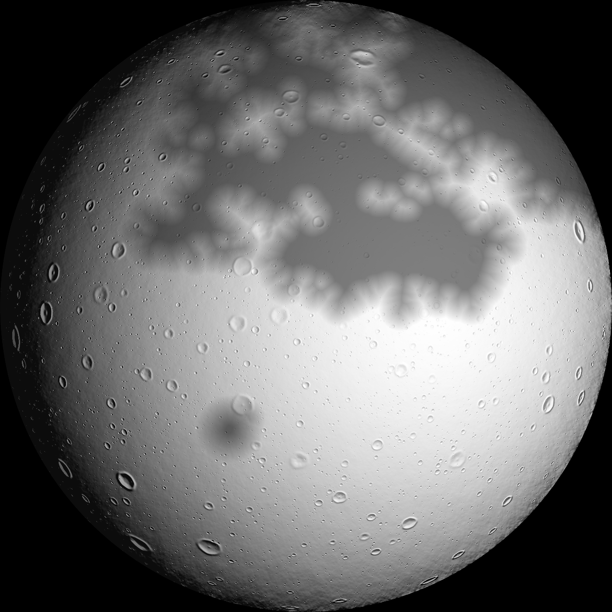
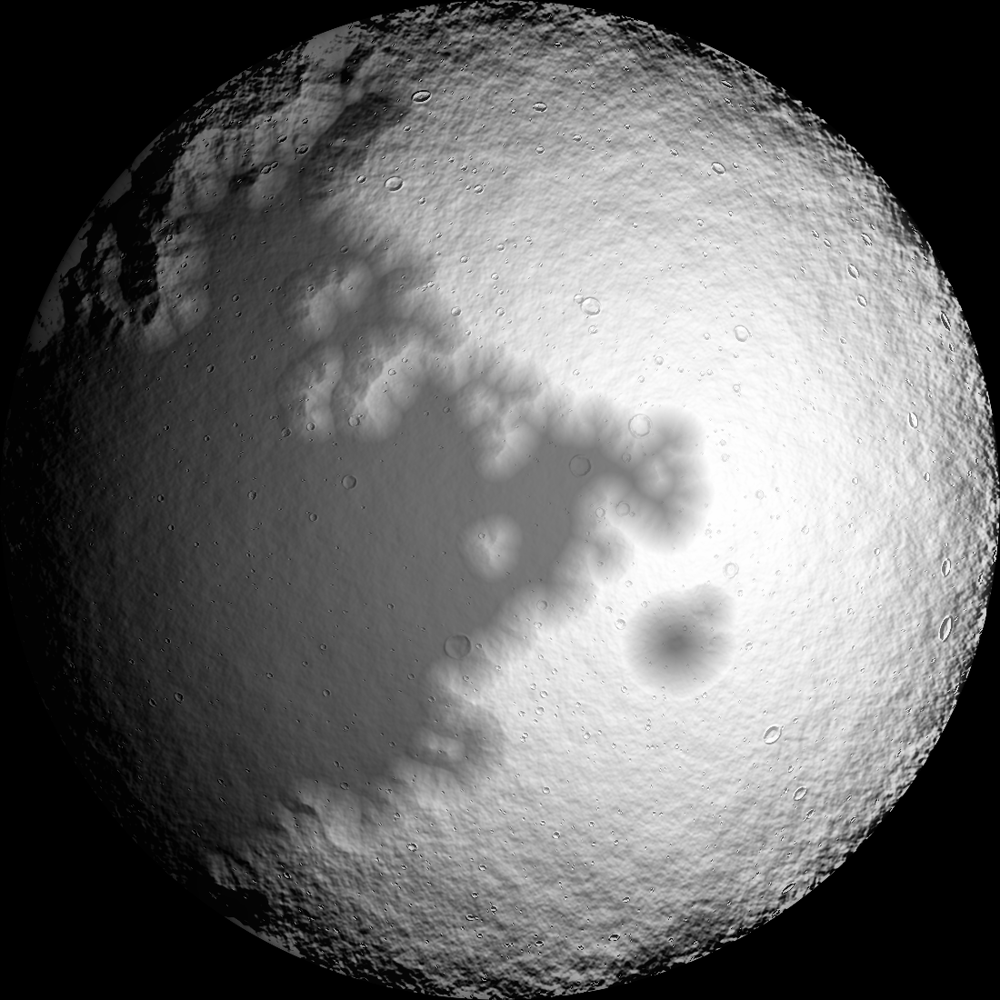
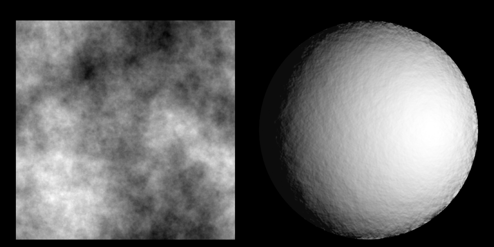
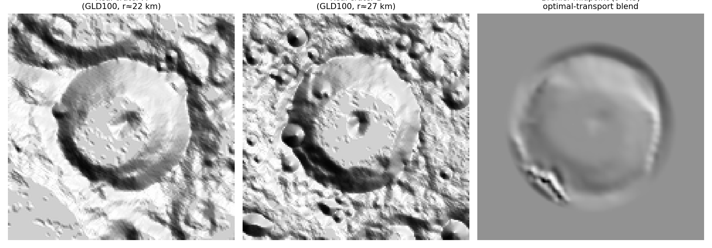
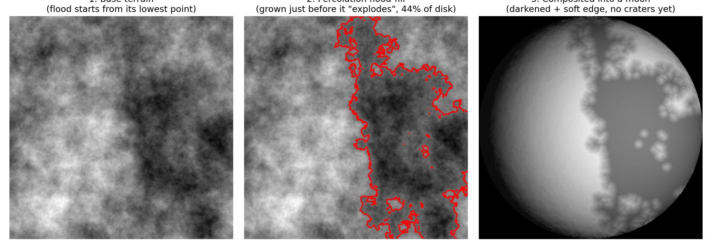

# moon-terrain

Synthetic lunar disk generator: fractal terrain, physically-shaded spherical
rendering, procedural or **real-crater** (optimal-transport blended) craters,
and lava-flooded maria grown by simulated percolation. Two generators share
the same terrain/lighting/maria code and expose almost the same parameters:

- **`moon_disk.py`** — fully procedural craters (analytic bowl/rim profiles,
  fit to real depth/diameter scaling laws).
- **`moon_generation_ot/moon_ot.py`** — craters built from *real* Lunar
  Reconnaissance Orbiter data instead of a formula, via optimal transport
  (see below).

| Procedural (`moon_disk.py`) | Optimal-transport craters (`moon_ot.py`) |
| --- | --- |
|  |  |

Both images: two maria (one grown from the fractal terrain, one seeded from
a 200&nbsp;km crater), same phase, thousands of craters following a
realistic size-frequency power law (the optimal-transport generator needs
far fewer to look this detailed — see [Notes](#notes)).

## Quick start

```bash
pip install numpy scipy pillow matplotlib

# procedural craters, single moon
python3 moon_disk.py --grid 1000 --n 1 --phase 25 \
    --n-craters-min 8000 --n-craters-max 8500 \
    --maria-style flood --maria-n-basins 2 --maria-flood-smooth 6 \
    --albedo-contrast 0.5 --add-crater-mare --crater-mare-diam-km 200 \
    --out out_moons

# real craters via optimal transport, single moon
cd moon_generation_ot
python3 moon_ot.py --grid 1000 --phase 25 \
    --n-craters-min 2500 --n-craters-max 2700 \
    --maria-n-basins 2 --maria-flood-smooth 6 \
    --albedo-contrast 0.5 --add-crater-mare --crater-mare-diam-km 200 \
    --out out_moon.png
```

`moon_disk.py --out` is a **folder** (it can render a preview grid of `--n`
moons at once); `moon_ot.py --out` is a single **file** (it always renders
exactly one moon per run, since building/reusing the crater pool is the
expensive step — expect a couple of minutes at the default `--n-pool 300`,
mostly spent building that pool, independent of `--grid`). Run either script
with `--help` for the full flag list — also reproduced in the
[parameter reference](#parameter-reference) below.

## How it works

### 1. Base terrain: fractal noise



Everything starts from a 2D height field generated by spectral synthesis:
white noise is shaped in Fourier space to follow a power-law spectrum
`|k|^-β`, then transformed back to real space. This produces the same kind
of self-similar, "fractal" roughness real terrain has, without the
directional grid artifacts that grid-based methods (e.g. diamond-square)
tend to leave behind. `β ≈ 3.1` was measured directly from a real GLD100
lunar DEM patch near Tycho and is the generator's default.

This field alone (left panel above) is dimensionless; the right panel shows
it rendered with the actual spherical shading pipeline — orthographic
projection, a per-pixel-correct local sun angle (not a single global
light/dark mask), and no craters or maria added yet. It's the "canvas" that
craters are carved into and that maria are regionalized from.

### 2. Craters

**Procedural (`moon_disk.py`, default).** Each crater is placed at a random
position, with a radius drawn from a power law `N(>D) ∝ D^-b` (`b ≈ 1.8–2.0`,
the real lunar crater size-frequency exponent) and an analytic bowl+rim
profile whose depth/diameter and rim/diameter ratios follow real scaling
laws (Pike-type), validated against a measured GLD100 profile of Tycho.
Degradation, minor rim irregularity, and a central peak for large complex
craters are added for visual variety.

**Optimal transport (`moon_ot.py`) — real craters, blended.** This is the
more interesting alternative: instead of a formula, each crater's *shape*
comes from actual topography captured by NASA's Lunar Reconnaissance
Orbiter (LRO) — specifically the GLD100 global lunar DEM (full citation
under [Acknowledgments & references](#acknowledgments--references) below).



The idea, step by step:

1. **A curated library of real craters.** ~770 craters (9–120&nbsp;km
   diameter) were auto-detected in the GLD100 global mosaic (blob detection
   on the elevation map), then each was cropped into a small, high-resolution
   canonical patch (radius normalized to 1, spline-resampled) and filtered
   for a clean, simple bowl shape (a "rim-cleanliness" score rejects
   obviously degraded or overlapping craters).
2. **Optimal transport between two real craters.** Given two library craters
   of similar size, each is represented as a cloud of points `(x, y, height)`
   on the same canonical grid. The Hungarian algorithm computes the exact
   minimum-cost assignment between the two point clouds (this is a discrete
   optimal transport plan). Following that assignment **halfway** (t = 0.5,
   the McCann/Brenier displacement-interpolation midpoint) — and lightly
   smoothing the resulting displacement field to remove the salt-and-pepper
   noise that an exact discrete assignment tends to leave — produces a
   *third* crater shape: a genuine morph between the two real ones, not a
   simple cross-fade. The left two panels above are two real source craters;
   the right panel is their midpoint. Notice the blended crater keeps a
   plausible single rim and floor, inheriting asymmetries from both parents,
   rather than looking like a double-exposed photograph.
3. **A precomputed pool, reused with rotation.** The Hungarian assignment
   costs a fraction of a second — cheap once, but far too slow to redo for
   every one of the thousands of craters a scene needs. So a pool of a few
   hundred distinct shapes is built once per run (`--n-pool`, this is what
   dominates `moon_ot.py`'s runtime), and each placed crater reuses the
   nearest-sized pool entry with a random rotation and a depth recalibration
   to the target size — so two placed craters are never identical, without
   paying the transport cost per crater.

The result: the same statistical placement (size-frequency power law,
maria-suppression, boundary-conflict avoidance) as the procedural generator,
but every crater's fine morphology — slightly lopsided rims, off-center
floors, subtle secondary texture — comes from a real lunar DEM instead of a
symmetric formula.

### 3. Maria: growing basins by simulated percolation



Maria (the dark "seas") are regionalized separately from individual
craters: a whole region gets lower albedo, flatter/smoother relief, and
fewer large surviving craters (simulating an old impact basin that got
flooded by basaltic lava and buried).

The `flood` style (the default for `moon_ot.py`, selectable in
`moon_disk.py`) grows a mare organically instead of stamping down a circle:

1. Start from one of the **lowest points** of the base fractal terrain (a
   real low-lying basin, not an arbitrary spot).
2. Sweep an elevation **threshold upward** and track the connected "flooded"
   region below it — exactly like raising water level in a landscape.
3. Correlated fractal fields like this one have a sharp **percolation
   transition**: the flooded area grows slowly, then suddenly "explodes"
   into a much larger connected component once the threshold crosses a
   critical value. The growth is stopped just *before* that explosion
   (found by bisection for a clean cutoff), which is what gives the basin
   its organic, branching, river-delta-like outline (middle panel above) —
   very different from — and much less regular than — a stamped circle.
4. The resulting shape gets a soft-edged transition to the surrounding
   highland (`--maria-edge-width`, a *reflectivity* gradient) and, optionally,
   a rounding-off pass (`--maria-flood-smooth`, an actual *shape* dilation
   that fills in the thinnest tendrils) before it's composited into the
   terrain, darkened, and rendered (right panel above).

An optional **second, smaller basin** (`--add-crater-mare`) can be added
with the same growth mechanism, but seeded from an artificially dug crater
of a given diameter (default 200&nbsp;km) instead of a natural terrain
minimum, and capped to a much smaller size — modeling "a large crater whose
floor partially flooded", distinct from a full impact basin.

## Parameter reference

Both scripts accept `--grid` (render resolution), `--seed`, `--phase`
(0–360°, 0/360 = full moon, 180 = new moon, wraps like any angle),
`--n-craters-min/max`, `--albedo-contrast`, `--add-crater-mare` (+
`--crater-mare-diam-km`, `--crater-mare-max-coverage`), `--maria-n-basins`
(force 0/1/2 instead of random), `--maria-flood-smooth` (basin *shape*
rounding), `--maria-edge-width` (basin *albedo* transition softness),
`--maria-crater-suppression` and `--maria-density-mult` (large-crater
flooding vs. uniform density thinning inside maria — independent effects),
and `--out`.

### `moon_disk.py`-only flags

| Flag | Meaning |
| --- | --- |
| `--n` | how many moons to render into a preview grid (`--out` is a folder) |
| `--max-crater-km` / `--min-crater-km` | diameter range of the "normal" crater population (default 150 / 5 km) |
| `--n-large-craters-mean` | mean count (Poisson) of a second, separately-sized "large crater" population (default 2.0; 0 disables it) |
| `--large-crater-min-km` / `--large-crater-max-km` | size range of that large-crater population (default: `--max-crater-km`–300 km) |
| `--exponent` | crater size-frequency power-law exponent `b` in `N(>D) ∝ D^-b` (default 1.9; higher = relatively more small craters) |
| `--crater-foreshorten-strength` | perspective ellipse correction for craters near the limb (1.0 = physically exact, default) |
| `--allow-crater-overlap` | stop rejecting positions where two crater rims cross (containment is always allowed regardless) |
| `--relief-scale` | multiplier on each crater's already-physical depth (default 0.75: slightly flattened, compensated by `--relief-strength`) |
| `--relief-strength` | shading-only contrast boost for local slope (doesn't touch the real heightfield or cast shadows) |
| `--base-amp-frac` | amplitude of the diffuse, structureless background roughness (small — most fine texture now comes from crater density, not this) |
| `--terrain-beta` | spectral slope `β` of the base fractal field (default 3.1, measured from a real DEM) |
| `--no-maria` | disable maria entirely (uniform albedo/roughness) |
| `--maria-coverage` | target mare coverage fraction, only for `--maria-style disks` |
| `--maria-style {disks,flood}` | overlapping-circles basins vs. percolation-grown basins (default `disks` here; `moon_ot.py` always uses `flood`) |
| `--maria-smoothing` | how much fine background roughness survives inside a mare, in [0,1] (default 0.6) |
| `--highland-roughness-mult` | highland fine roughness as a multiple of the maria's (default 2.0) |
| `--shadow-step` | cast-shadow ray-march step multiplier (higher = faster/coarser, useful for quick large-grid tests) |

### `moon_ot.py`-only flags

| Flag | Meaning |
| --- | --- |
| `--n-pool` | number of distinct optimal-transport crater shapes to precompute and reuse (default 300 — this is what dominates runtime; fewer = faster but less shape variety) |
| `--verbose` | print pool-build and placement timing |

Note: `moon_ot.py` always renders exactly one moon per run (no `--n`) and
always uses the percolation `flood` maria style — building/reusing the
crater pool is the expensive step, so there's no cheap "preview grid" mode
here the way there is in `moon_disk.py`.

## Requirements

Python 3.9+ recommended. Modules that use `X | None`-style type hints
already start with `from __future__ import annotations`, which defers their
evaluation, so 3.7+ works too. Also needs `numpy`, `scipy`, `Pillow`, and
`matplotlib` (only
needed for `moon_disk.py`'s multi-moon preview grid).

The curated real-crater library (`curated_library.pkl`, ~80 MB, 771 craters
extracted from the LRO WAC GLD100 mosaic) that `moon_ot.py` needs is **not**
tracked in this git repository — it's too large for GitHub's normal file
size limits. Instead, download it from this repository's
[**Releases**](../../releases) page and place it at
`moon_generation_ot/crater_library/curated_library.pkl` before running
`moon_ot.py`. Rebuilding it from scratch instead of downloading it
additionally needs `scikit-image` and the raw GLD100 tile, but that's only
relevant if you want to change the source data.

## Notes

- `moon_disk.py` is the faster, fully self-contained generator: good for
  quick iteration, huge crater counts, and very large grids.
- `moon_ot.py` trades some speed (the crater-pool build) for craters whose
  fine morphology comes from real topography instead of a formula — most
  noticeable at moderate-to-high zoom, with a handful of large craters
  visible in detail rather than thousands of tiny dots.
- Both are seeded/deterministic given `--seed` and `--phase`: the same
  values reproduce the same moon.

## Acknowledgments & references

Developed together with [Claude](https://claude.com) (Anthropic).

The idea of morphing between two real shapes via optimal transport was
inspired by the shape-interpolation demos (e.g. the cow → duck → torus
sequence in their Figure 1) in:

> J. Solomon, F. de Goes, G. Peyré, M. Cuturi, A. Butscher, A. Nguyen, T. Du,
> L. Guibas. **Convolutional Wasserstein Distances: Efficient Optimal
> Transportation on Geometric Domains.** *ACM Transactions on Graphics
> (Proc. SIGGRAPH)*, 34(4), 66:1–66:11, 2015.

The displacement-interpolation ("midpoint", t=0.5) construction this project
uses follows:

> Y. Brenier. **Polar factorization and monotone rearrangement of
> vector-valued functions.** *Communications on Pure and Applied
> Mathematics*, 44(4), 375–417, 1991. (existence/uniqueness of the optimal
> transport map)
>
> R. J. McCann. **A convexity principle for interacting gases.** *Advances
> in Mathematics*, 128(1), 153–179, 1997. (the interpolating path between
> two measures along that map — what this project calls the "Brenier
> midpoint")

The discrete assignment itself is a classical (Kantorovich) transportation
problem, solved here exactly via the Hungarian algorithm
(`scipy.optimize.linear_sum_assignment`) rather than the entropic/Sinkhorn
relaxation used in some of the papers above.

Real crater topography comes from data acquired by **NASA's Lunar
Reconnaissance Orbiter (LRO)**, specifically the near-global 100 m/pixel
digital terrain model derived from stereo images taken by its Wide Angle
Camera (WAC):

> F. Scholten, J. Oberst, K.-D. Matz, T. Roatsch, M. Wählisch, E. J.
> Speyerer, M. S. Robinson. **GLD100: The near-global lunar 100 m raster
> DTM from LROC WAC stereo image data.** *Journal of Geophysical Research:
> Planets*, 117(E12), E00H17, 2012.
> [doi:10.1029/2011JE003926](https://doi.org/10.1029/2011JE003926)
